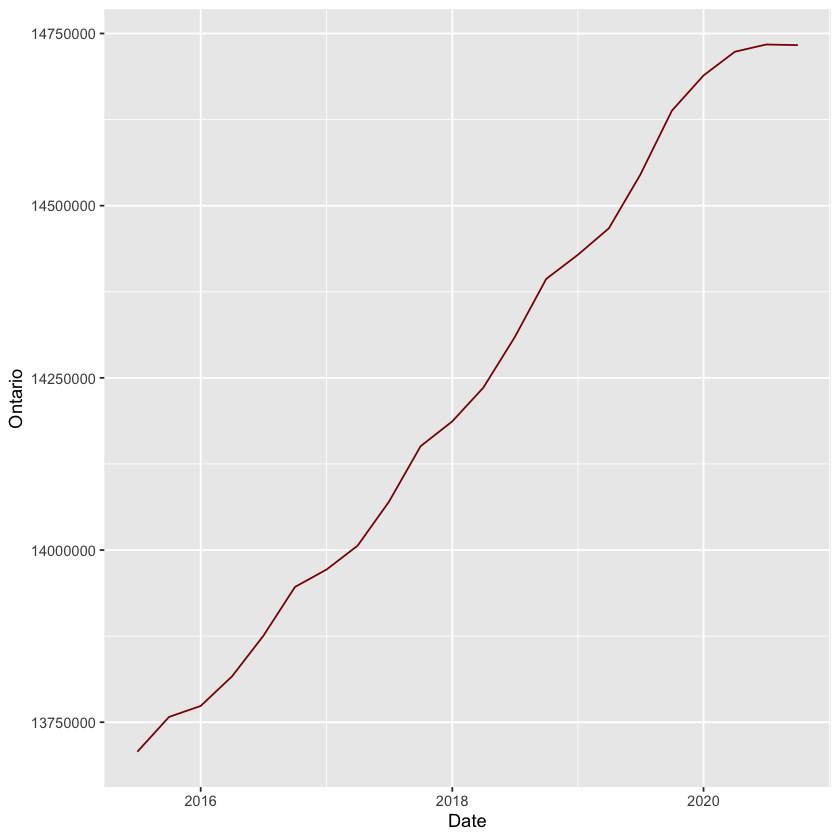
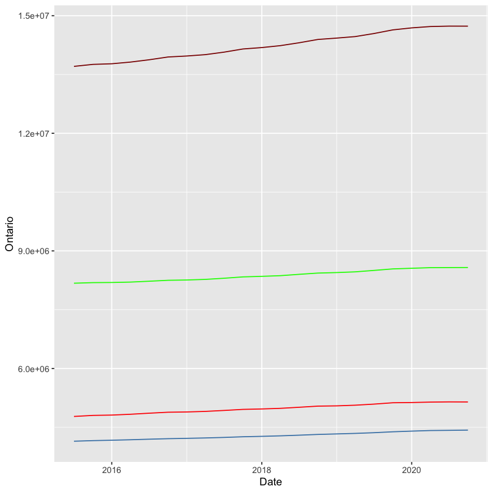

  [](https://www.tidyverse.org/lifecycle/#experimental)

R package wrapping a RESTful API for the Statistics Canada Web Data Service (API) (https://www.statcan.gc.ca)

## Description

Statistics Canada is Canada’s national statistical office. The agency ensures Canadians have the key information on Canada's economy, society and environment that they require to function effectively as citizens and decision makers.

Statistics Canada Web Data Service is an API service, which will provide access to data and metadata released by Statistics Canada each business day. This web service provides an access to the main Statistics Canada output database via a number of "calls" or "methods" that harvest the data and metadata in its raw form and return it to the caller.

`our-package` allows one to extract data for a given date range using vectors and extract the entire time series for selected tables in CSV output format.

See https://www.statcan.gc.ca/eng/developers/wds for API docs for the Statistics Canada Web Data service (API).


## Installation

From CRAN


```r
? install.packages(“our-package”)
```

? Or the development version from Github 


```r
remotes::install_github(“our-repository/our-package“)
```

Load package


```r
library(“our-package”)
```


## statcan_daterange
This function allows one to extract data for a given date range using vectors.

To get information from Statistics Canada, you need a vectorID. vectorsID’s are unique identifiers to a time series of data points. (i.e. v123456).

The following is a general procedure to get the vectorID of interest:

1. Go to Statcan Data https://www150.statcan.gc.ca/n1//en/type/data?MM=1#tables
2. Look for your preferred dataset.
3. Click Add/Remove data.
4. Click on Customize layout.
5. Scroll down and tick the option Display Vector identifier and coordinate, then click the button Apply.
6. On the vector column, you can find the vectorID.

### Use case
This example shows one way to use our wrapper for Date Ranges.

We will plot the population estimates for Canada’s four biggest provinces from January 2019 to December 2020. Ontario (vectorID=v12), Alberta (vectorID=v15), Quebec (vectorID=v11) and British Columbia (vectorID=v3). 

* Call the `statcan_daterange` function with the desired vector and specific `start_time` and `end_time`.

```r
Ontario <- statcan_daterange("v12", start_time = "2019-01-01", end_time = "2021-02-18")
Alberta <- statcan_daterange("v15", start_time = "2019-01-01", end_time = "2021-02-18")
Quebec <- statcan_daterange("v11", start_time = "2019-01-01", end_time = "2021-02-18")
BC <- statcan_daterange("v3", start_time = "2019-01-01", end_time = "2021-02-18")
```

Inspect the output

```r
head(Ontario)
A data.frame: 6 × 2
refPer	value
<chr>	<dbl>
1	2015-07-01	13707118
2	2015-10-01	13757688
3	2016-01-01	13773629
4	2016-04-01	13816545
5	2016-07-01	13875394
6	2016-10-01	13946431
```

You will note that the function returns a dataframe. This means that you can interrogate the dataframe as per usual. This provides access to large datasets of high quality which to build and integrate.

* Handle datatypes by changing the date column

```r
Ontario$refPer <- as.Date(Ontario$refPer)
Alberta$refPer <- as.Date(Alberta$refPer)
Quebec$refPer <- as.Date(Quebec$refPer)
BC$refPer <- as.Date(BC$refPer)
```

* Merge the dataframe for analysis

```r
pop_estimates <- merge(Ontario, Alberta, by=c("refPer"))
pop_estimates <- merge(pop_estimates, Quebec, by=c("refPer"))
pop_estimates <- merge(pop_estimates, BC, by=c("refPer"))
```

Inspect the output

```r
head(pop_estimates)
A data.frame: 6 × 5
refPer	value.x	value.y	value.x	value.y
<date>	<dbl>	<dbl>	<dbl>	<dbl>
1	2015-07-01	13707118	4144491	8175272	4776388
2	2015-10-01	13757688	4159519	8190014	4802955
3	2016-01-01	13773629	4169830	8193624	4811465
4	2016-04-01	13816545	4181765	8204085	4832155
5	2016-07-01	13875394	4196061	8225950	4859250
6	2016-10-01	13946431	4208958	8249692	4884002
```

* Change column names for analysis

```r
NewNames <- c('Date', 'Ontario', 'Alberta', 'Quebec', 'BC')
names(pop_estimates) <- NewNames
```

Inspect the output

```r
A data.frame: 6 × 5
Date	Ontario	Alberta	Quebec	BC
<date>	<dbl>	<dbl>	<dbl>	<dbl>
1	2015-07-01	13707118	4144491	8175272	4776388
2	2015-10-01	13757688	4159519	8190014	4802955
3	2016-01-01	13773629	4169830	8193624	4811465
4	2016-04-01	13816545	4181765	8204085	4832155
5	2016-07-01	13875394	4196061	8225950	4859250
6	2016-10-01	13946431	4208958	8249692	4884002
```

* Plot one column using the ggplot 2 library

```r
library(ggplot2)
ggplot(pop_estimates, aes(x=Date)) + 
    geom_line(aes(y = Ontario), color = "darkred")
```

Inspect the output



* Plot the four columns using the ggplot 2 library

```r
ggplot(pop_estimates, aes(x=Date)) + 
    geom_line(aes(y = Ontario), color = "darkred") +
    geom_line(aes(y = Alberta), color="steelblue") +
    geom_line(aes(y = Quebec), color = "green") + 
    geom_line(aes(y = BC), color="red")
```

Inspect the output



## getFullTableDownloadCSV


```r
example = getFullTableDownloadCSV(14100287)
```

Inspect the output

```r
pending
{
  "status": "SUCCESS",
  "object": "https://www150.statcan.gc.ca/n1/tbl/csv/14100287-eng.zip"
}
```
This specific request downloads the entire table.

## IDs for products
You can find IDs for products by coordinating them with CANSIM numbers you come across on the StatsCan website.
A full mapping from CANSIM numbers to IDs is available at: https://www.statcan.gc.ca/eng/developers/concordance

You can search by vector at https://www150.statcan.gc.ca/t1/tbl1/en/sbv.action 

## Contributors
Mandar Kathe @Mandar_Kat

Samuel Velez @samuel-velez

Vicens Paneque @VicensPaneque

## Meta

* Please [report any issues or bugs](https://https://github.com/samuel-velez/Statistics_Canada_API_Wrapper/issues).
* License: [MIT](https://github.com/samuel-velez/Statistics_Canada_API_Wrapper/blob/Vicens/LICENSE).
* Please note that this project is released with a [Contributor Code of Conduct](https://github.com/samuel-velez/Statistics_Canada_API_Wrapper/blob/Vicens/CONDUCT.md). By participating in this project you agree to abide by its terms.
